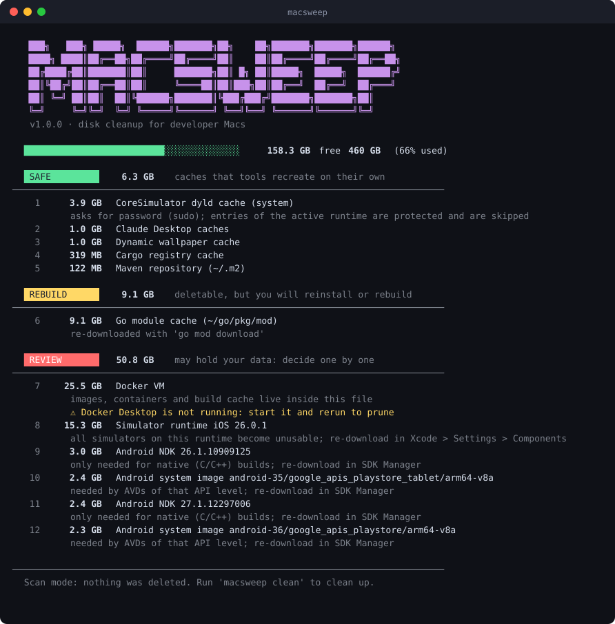
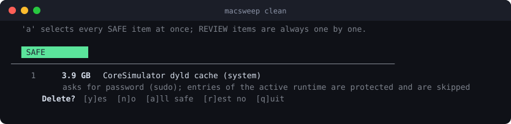
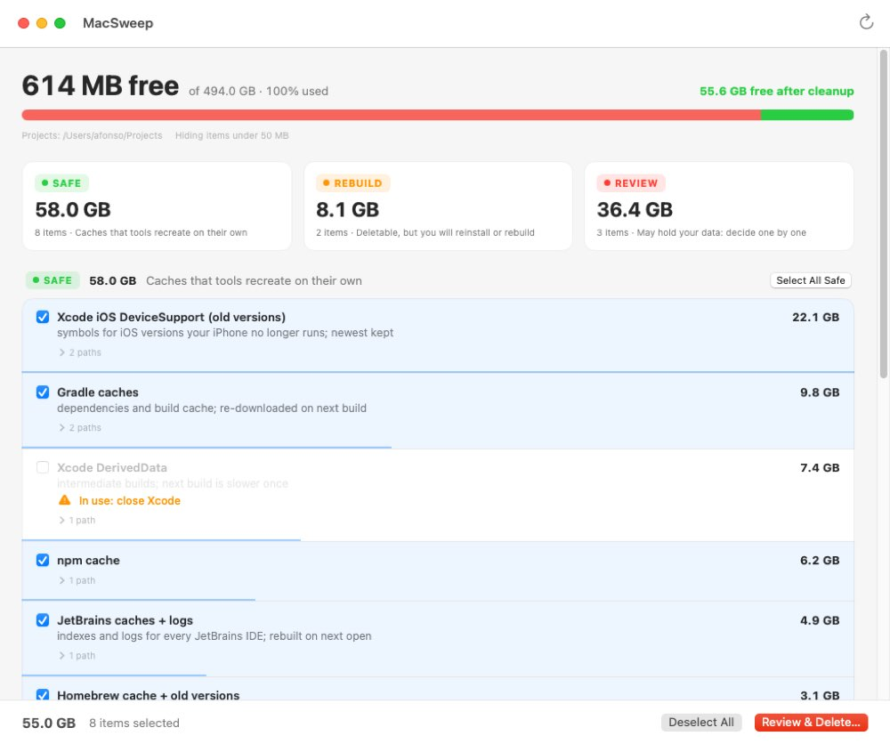

<p align="center">
  
</p>

<h1 align="center">macsweep</h1>

<p align="center">
  <b>Interactive disk cleanup for developer Macs.</b><br>
  Finds the caches, build artifacts, simulators, emulators and worktrees that quietly eat your disk,
  tells you how risky each one is, and asks before it deletes anything.
</p>

<p align="center">
  <a href="#install">Install</a> ·
  <a href="#usage">Usage</a> ·
  <a href="#mac-app">Mac app</a> ·
  <a href="#what-it-finds">What it finds</a> ·
  <a href="#safety">Safety</a> ·
  <a href="#português">Português</a>
</p>

<p align="center">
  
  
  
  
</p>

---

## Why

My 500 GB MacBook had **600 MB free**. Nothing was wrong with it. It was just full of things no tool ever cleans up for you:

| | |
|---|---|
| Xcode symbols for four versions of the same iPhone | 22 GB |
| Three Android emulators, each with 10 GB of user data | 39 GB |
| Two iOS simulator runtimes | 34 GB |
| `node_modules` in projects I had not opened in months | 13 GB |
| npm, Gradle, Go, JetBrains, Homebrew, pip, uv caches | 40 GB |
| Claude Code worktrees with a 2 GB zip committed twice | 5 GB |

One afternoon later: **158 GB free**. `macsweep` is that afternoon, turned into a script you can run every few months.

## Install

```bash
curl -fsSL https://raw.githubusercontent.com/MJAZ93/macsweep/main/install.sh | bash
```

The installer drops one file into the first writable directory already on your `PATH`: `/opt/homebrew/bin`, then `/usr/local/bin`, then `~/.local/bin` (in which case it adds that directory to your `~/.zshrc` or `~/.bashrc`). If your current terminal was opened before the install, run `exec $SHELL` or open a new tab once.

Or just grab the file yourself:

```bash
curl -fsSL https://raw.githubusercontent.com/MJAZ93/macsweep/main/macsweep -o /opt/homebrew/bin/macsweep && chmod +x /opt/homebrew/bin/macsweep
```

It is a single bash script. No Homebrew, no Python, no Node. Works with the bash 3.2 that ships with macOS.

**Update:** run the install command again. **Uninstall:** `rm "$(which macsweep)"`.

## Usage

```bash
macsweep              # scan: measures everything, deletes nothing
macsweep clean        # interactive: asks yes / no for every item
macsweep clean --yes  # pre-select every SAFE item (you still confirm at the end)
```

<p align="center">
  
</p>

Every item is one keypress:

| key | meaning |
|---|---|
| `y` | delete this one |
| `n` | keep it |
| `a` | yes to this and every other **SAFE** item (never applies to REBUILD or REVIEW) |
| `r` | keep everything from here on |
| `q` | quit, delete nothing |

At the end you get a summary with the total and have to type `DELETE` before anything happens. Then it deletes, shows how much it freed, and writes a log to `~/Library/Logs/macsweep.log`.

## Mac app

<p align="center">
  
</p>

Prefer clicking to typing? **MacSweep.app** is a native SwiftUI app with the same catalog and the same rules: everything grouped by tier and sorted by size, a disk bar that shows how much you will have free afterwards, a list of the exact paths behind each item (with **Show in Finder**), a review sheet where you type `DELETE`, and live progress while each item goes. Items in use are greyed out, **Select All Safe** only ever touches SAFE items, and every deletion goes to the same log. The one step that needs an admin password asks for it in the normal macOS dialog. English and Portuguese, light and dark, macOS 13 or newer.

The app does not reimplement anything: it ships the `macsweep` script inside the bundle and runs it, so the CLI and the app always agree on what is safe.

**Install:** download `MacSweep.zip` from [Releases](https://github.com/MJAZ93/macsweep/releases), unzip, drag `MacSweep.app` to Applications. The app is not notarized, so the first time macOS will refuse to open it: right-click it and pick **Open** (on macOS 15, go to *System Settings → Privacy & Security → Open Anyway*), or run `xattr -dr com.apple.quarantine /Applications/MacSweep.app`.

**Build it yourself** (Xcode or the Command Line Tools):

```bash
git clone https://github.com/MJAZ93/macsweep && cd macsweep
app/build-app.sh                  # → app/build/MacSweep.app
open app/build/MacSweep.app
```

Settings (⌘,) has the projects folder, the inactivity threshold, the minimum size, the fast scan and the dry run. ⌘R rescans.

### Options

| flag | default | what |
|---|---|---|
| `--projects DIR` | first of `~/Documents/local`, `~/Projects`, `~/code`, `~/dev`, `~/src`, `~/Developer` | where your repos live |
| `--days N` | `30` | a project is "inactive" if no source file changed in N days |
| `--min-mb N` | `50` | hide items smaller than this |
| `--fast` | | skip the project scan |
| `--dry-run` | | go through the whole flow, delete nothing |
| `--lang en\|pt` | from `$LANG` | interface language |
| `--no-color` | | plain output |

## What it finds

Everything is sorted into three tiers. The tier tells you what you lose.

### 🟩 SAFE — caches that tools recreate on their own

Xcode DerivedData · old iOS DeviceSupport symbols (keeps the newest per device) · CoreSimulator caches · unavailable simulators · Swift PM and CocoaPods caches · Android emulator snapshots · Gradle caches and distributions · Android Studio caches and logs · JetBrains caches and logs · npm, pnpm, Yarn, Bun caches · Go build cache · pip, uv, Cargo, Maven, pub caches · Puppeteer and Playwright browsers · Homebrew cache and old versions · Chrome cache · Electron app updater leftovers · dynamic wallpaper cache

### 🟨 REBUILD — deletable, but you will reinstall or rebuild

Go module cache · `node_modules`, `build`, `Pods`, `.venv`, `.gradle`, `target`… in **inactive projects only**. A project counts as inactive when none of its source files changed in the last 30 days (`.DS_Store`, lockfiles, build output and IDE folders do not count as activity).

### 🟥 REVIEW — may hold your data, decide one by one

iOS simulator runtimes (one item per runtime) · Android AVD "wipe data" (factory reset, keeps the device) · Android NDK and system images (one item each) · Docker VM (offers `docker system prune -a`, volumes are kept) · Claude Code / git worktrees that are **clean** (worktrees with uncommitted changes are never offered) · Trash

Items that are *in use* (Xcode open, emulator running, Chrome open, Gradle daemon alive…) are shown with a ⚠ and cannot be selected until you close the app.

## Safety

- **Scan is the default.** Running `macsweep` with no arguments never deletes anything.
- **Allow-list only.** It deletes exactly the paths in its catalog, with absolute paths. It never walks your home looking for "big stuff" to remove.
- **Two confirmations.** One keypress per item, then you type `DELETE` for the batch.
- **Refuses to run as root.** The one system path that needs `sudo` (the CoreSimulator dyld cache) asks for your password at that step only.
- **Running apps block their items.** You cannot delete DerivedData while Xcode is open, or Gradle caches while a Gradle daemon is alive.
- **Worktrees:** only clean ones are offered, and the branch is left untouched. SQL dumps, databases, downloads and documents are never touched at all.
- **Log.** Every deletion goes to `~/Library/Logs/macsweep.log`.

## Contributing

The app lives in `app/` (Swift Package, no dependencies). `swift test` runs the parser tests, `app/scripts/test-engine.sh` runs the script's app modes against a fake home, and CI builds the app on every push.

The catalog is a list of `add TIER "label" "note" "blocker" handler path…` lines inside `scan()`. Adding a cache is one line. PRs welcome, especially for tools I do not use.

```bash
add SAFE "Yarn cache" "" "" rm "$C/Yarn" "$HOME/.yarn/berry/cache"
```

## License

MIT © [Afonso Júnior](https://github.com/MJAZ93)

---

## Português

**macsweep** é um script interactivo de limpeza de disco para Macs de developers. Encontra caches, artefactos de build, simuladores, emuladores e worktrees que ocupam espaço sem ninguém dar por isso, diz-te o risco de cada item e pergunta antes de apagar.

```bash
macsweep              # análise: mede tudo, não apaga nada
macsweep clean        # interactivo: pergunta sim / não por item
macsweep clean --yes  # pré-selecciona todos os SEGUROS (confirmas no fim)
```

Também há uma **app para Mac** (SwiftUI, macOS 13+): a mesma análise e as mesmas regras, mas escolhes tudo com cliques, vês quanto espaço vais ter no fim, revês a lista e escreves `APAGAR` para confirmar. Descarrega o `MacSweep.zip` em [Releases](https://github.com/MJAZ93/macsweep/releases) (da primeira vez abre com clique direito → **Abrir**, porque a app não é notarizada) ou compila com `app/build-app.sh`. A interface segue o idioma do sistema e pode mudar-se nas Definições.

Instalar:

```bash
curl -fsSL https://raw.githubusercontent.com/MJAZ93/macsweep/main/install.sh | bash
```

O instalador põe um único ficheiro na primeira pasta com escrita que já esteja no teu `PATH` (`/opt/homebrew/bin`, depois `/usr/local/bin`, depois `~/.local/bin`). Se o terminal já estava aberto antes de instalar, corre `exec $SHELL` ou abre uma aba nova. Para actualizar, repete o comando.

A interface muda para português automaticamente quando o teu `LANG` é `pt_*`, ou força com `--lang pt`. As teclas passam a ser `s` (sim), `n` (não), `t` (todos os seguros), `r` (resto não), `q` (sair), e a confirmação final é a palavra `APAGAR`.

Três níveis:

- 🟩 **SEGURO**: caches que as ferramentas recriam sozinhas.
- 🟨 **REGENERÁVEL**: apaga-se, mas vais ter de fazer `npm install` ou um build.
- 🟥 **VERIFICAR**: pode ter dados teus. Decide um a um.

Nunca toca em bases de dados, dumps SQL, downloads ou documentos. Só apaga caminhos da sua própria lista, com confirmação dupla, e regista tudo em `~/Library/Logs/macsweep.log`.
